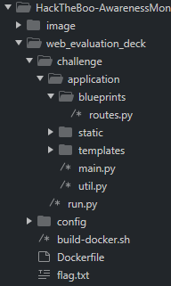

# **Hack The Boo - Web**

Đây là writeup bài web trong Hack The Boo AwarenessMonth2022.

Vào thẳng vấn đề chính nào :)

Bài này nó cho mình source code, mình có để [source ở đây](./web_evaluation_deck) mọi người có thể built trên docker chơi thử.


Vào web thì giao diện nó như sau.


Đây là một game lật bài diệt yêu quái, lá bài có thể giúp yêu quái tăng HP hoặc giảm HP, mình có thể lật 8 lần nếu qua 8 lần mà chưa diệt được yêu quái là mình thua. Mà thua hay thắng thì cũng restart lại từ đâu :))

Khi lật bài thì nó sẽ gửi 1 POST request với 3 tham số: current_health, attack_power, operator.


Giờ vào đọc source xem có gì hay ho không.

Trong file routes.py có đoạn code xử lý api

```
@api.route('/get_health', methods=['POST'])
def count():
    if not request.is_json:
        return response('Invalid JSON!'), 400

    data = request.get_json()

    current_health = data.get('current_health')
    attack_power = data.get('attack_power')
    operator = data.get('operator')
    
    if not current_health or not attack_power or not operator:
        return response('All fields are required!'), 400

    result = {}
    try:
        code = compile(f'result = {int(current_health)} {operator} {int(attack_power)}', '<string>', 'exec')
        exec(code, result)
        return response(result.get('result'))
    except:
        return response('Something Went Wrong!'), 500
```

Đoạn code trên sẽ lấy data từ request được gửi lên.

```
data = request.get_json()

    current_health = data.get('current_health')
    attack_power = data.get('attack_power')
    operator = data.get('operator')
```

Chuyển các data đó thành một đoạn mã bằng hàm compile().Trước khi compile thực thi thì current_health và attack_power sẽ được ép thành kiểu int.

```
code = compile(f'result = {int(current_health)} {operator} {int(attack_power)}', '<string>', 'exec')
```

Ví dụ: 
	current_health = "100"
	operator = "-"
	attack_power = "30"
	thì đoạn code đó sẽ chuyển thành đoạn mã *"result = 100 + 30"* , mình hiểu cơ bản là vậy.

Hàm *exec()* sẽ thực thi string như một đoạn mã.
> exec(code, result)

Trong source được cung cấp mình có thấy file *flag.txt*



### **Túm lại**:

- Mình có thể truyền vào 3 tham số current_health, attack_power, operator.
- Tất cả dữ liệu truyền vào không được fillter.
- 2 tham số current_health, attack_power sẽ được chuyển sang kiểu int trước khi xử lý => đầu ra sẽ phải là kiểu int.

=> Có thể truyền mã khai thác thông qua tham số operator, hàm exec() sẽ tiếp tay :) . 
Kết quả phải chuyển qua kiểu int để việc cộng với current_health, attack_power không gây lỗi.
Và mã khai thác của mình: [ở đây](./exploit.py)
